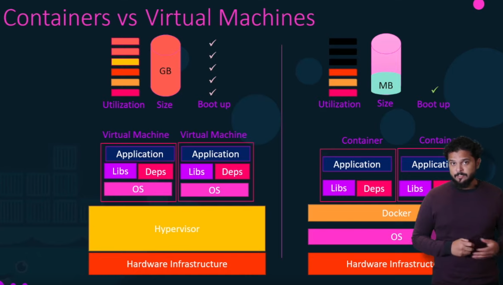

# Collection of Docker notes
> Most of these notes and images are not my original idea. Most came from the source links in the bottom of this file.

## Install docker on WSL1
```
sudo apt-get update

# Dependancies
sudo apt-get install apt-transport-https \
ca-certificates curl \
software-properties-common

# Add keys
curl -fsSL https://download.docker.com/linux/ubuntu/gpg | sudo apt-key add -

# Add repo for docker
sudo add-apt-repository "deb [arch=amd64] https://download.docker.com/linux/ubuntu $(lsb_release -cs) stable"

# Install dat bad boi
sudo apt-get update
sudo apt-get install docker-ce
```
## What is Docker
- Containers are completely isolated environments that share the same OS kernel
- Docker is a LXC
- You will not be able to run a windows based container on windows
- When you install a linux container on windows, docker is spinning up a linux VM to host the container 
- This does not have a performance draw back because it does not run a compelte OS



## General notes

> Dockers, unlike a VM, only runs until the service that it was ment to run is over. It is just a container to run a task. If there is no task it will die.

## Basic Commands

| Command | Description |
| ------- | -------- |
| `docker version` | List the version of docker that you are running |
| `docker images` | Display all the images that you have downloaded |
| `docker rm <name>` | Permenetly delete an image from disc |
| `docker images` | List all the images downloaded on disc |
| `docker pull` | Pulls a docker image without running it |
| `docker logs <id>` | Show stdout logs on a background container "run -d" |
| `docker history <image>` | Shows each step of what docker is doing particularly when building your own image |

## Run/Stop Images [Run Documentation](https://docs.docker.com/engine/reference/commandline/run/)
| Command | Description |
| ------- | -------- |
| `docker run <image>` | Runs the image if you have it downloaded, otherwise it will download it online |
| `docker run -d <image>` | `-d` will background your docker so it does not hijack your terminal |
| `docker run -d --name<nickname> <image>:<tag/version>` | `--name` gives your images a nickname |
| `docker run -d --name<nickname> -p 5001:80 <image>:<tag/version>` | `-p` specifies the port mapping, more on the port mapping section |
| `docker run -d -p 127.0.0.1:5001:80/tcp <image>` | To get access to the docker container you must create a localhost listener on the host machine that can reach the docker host |
| `docker run -d --name<nickname> -p 5001:80 --link <nick>:<host> <image>:<tag/version>` | `--link` links containers together by adding a entry in the host file of the container |
| `docker attach <id>` | If using `-d` to detach, you can re attach with this option |
| `docker run <image>:<tag>` | You can specify different versions or types of a container with the colon. Be default the <latest> tag will be used |
| `docker stop <id/name>` | Stops a docker from running |
| `docker exec <image> <command(cat /etc/passwd)>` | Run commands in your container |
| `docker exec -it <image> bash` | Get an interactive shell on the container |

## Show running images
| Command | Description |
| ------- | -------- |
| `docker ps` | Show the running containers |
| `docker ps -a` | Displays all running and *previously* running dockers |
| `docker inspect <image>` | Return the JSON payload that configured the image |

## Getting interactive in a non interactive image
```
docker create -it --name frosch_dev python
docker start frosch_dev
docker exec -it frosch_dev bash
```
## Networking
| Command | Description |
| ------- | -------- |
| `docker network ls` | View available networks
| `docker network create <args>` | create additional bridge networks, more info below |
| `docker inspect <image>` | View json payload that shows the networking settings

## Port mapping
- When you run a container it runs within the docker host
- If you run a container that listens on port 5000, the container is the one listening on 5000 on a internal IP within the docker host
- If you want your host OS to communicate with the container, you must map the ports from docker host to the container by using the docker host ip
```
docker run -p 80:5000 <image/name>
docker run -p 8000:5000 <image/name>
docker run -p 8001:5000 <image/name>
```

## Volume mapping
- For data to persist, you must map a directory with your container
```
docker run -v <host_dir>:<container_dir> <image>
docker run -v /opt/datadir:/var/lib/data <image>
```
- To create one you must use the docker create command

| Command | Description |
| ------- | -------- |
| `docker volume create <dir>` | Creates a new volumne on the docker directories for an image to use |
| `docker run -v <dir>:<image_dir> <image>` | Mount a local directory in the host os with the container |

### Volume Mounting vs Volume Bind
- There are two types of mounts you can use
    - Volumes are those volumes that are manages by the docker host and need the docker cli to create them. These can be utilized accross all OS even windows. When you mount with volume, you are mounting a directory from the volume directory
    - Binds are those that reflect the directory structure of the host itself. These may be more difficult to migrate to other systems. When you mount with a bind, you are mounting from **ANY** directory you choose from in the host OS
```
docker run -v <dir>:<image_dir> <image>
vs
docker run -v </full/path/dir>:<image_dir> <image>
```
#### The modern way to mount volumnes is to use the --mount not the -v
```
docker run --mount type=bind,source=/full/dir,target=/target/dir <image>
docker run --mount type=volume,source=<docker_volume>,--target=/target/dir <image>
```

# Composing dockers with YAML
- Instead of manually running/pulling different images you can create a yaml file that pulls all the images for you in one swoop

### Sample of the file `docker-compose.yml`
```
version: 3
services:
    web:
        image: <web_image>
        ports:
            - 5000:80
    database:
        build: ./<local_image_dir>
        network:
            <network_name>
            <network_name2>
    messaging:
        image: <app_image>
        network:
            <network_name>

networks:
    <network_name>:
    <network_name2>:
```
### Then we can run the config
```
docker-compose up
```

# Example of Setting Up an Image
## `1` Set up the docker file
```
# Must require an OS or Image to run
FROM Ubuntu                                       

# Install dependencies, obvi install based on versions
RUN apt-get update
RUN apt-get install python
RUN pip install flask
RUN pip install flask-mysql

# Copy the code to the container 
COPY . /opt/source-code

# Tell docker how to execute the code
ENTRYPOINT FLASK_APP=/opt/source-code/app.py flask run
```
## `2` Build the image using the docker file above
```
docker build $dockerfile -t <image>
```
- If an error is encountered, you are able to fix the error and it will continue to build the image from where it left off so that it does not have to start from layer 1 all over again
- This will create an iamge locally
- Because docker images are built in layers, any changes to any of these layers does not result in remaking the whole image again. If only the source code was changed then when you rebuild the image, it is possible to resuse most of the layers that were already built for your new image
## `3` You can push your image to docker hub
```
docker push <image>
```

# Docker image files
## CMD
- The CMD command can either have a string or an array of commands and args to follow
```
CMD ["command", "arg"] 
or
CMD command arg
```

## ENTRYPOINT
- You can specify a command to invoke automatically so that any arguments you pass to the `docker run` will automatically be passed to this command
```
ENTRYPOINT ["command"]
```
- Then what ever args you pass when you run the docker is passed to it
```
docker run <image> <arg>
```

## CMD + ENTRYPOINT
- You can speficy default values to your command by using both CMD and ENTRYPOINT. If no arguments are used when calling the docker run then the argument in CMD will be used. Otherwise the command line argument will replace this default value
```
ENTRYPOINT ["command"]
CMD ["defualt_arg"]
```
- Then you can either run the docker with or without an argument
```
docker run <image> arg1
or
docker run <image>  # Now "default_arg" is passed
```

# Docker Networking
- Three networks are set up automatically
    - bridge
    - none
    - host

## Bridge
- this one is used when you run `docker run <image>`
- All containers within the host docker will have access to each other by using this method

## Host
- You can assign the host os networking by specifying 
```
docker run <image> --network=host
```
- that means that you do not need to port map in this case

## None
- The container is isolated by itself

## Multiple internal networks
- By default, docker only makes one internal network
- You can create multiple networks with the network create command
```
docker network create \
    --driver bridge
    --subnet <ip>/<cidr>
    <name_of_network>

# Then view network with 
docker network ls
```

## Best practice
- It is best practice **NOT** to use private IP address when attempting to configure containers that communicate with each other because those IPs can change
- Instead, you want to leverage the docker dns and utilize the container names to communicate between containers

# Volumes
- When you install docker on a system it creates a filesystem such as
```
/var/lib/docker
|_ aufs
|_ containers
|_ image
|_ volumes
```
- There is two layers to a container when it comes to volumes
    - container layer which you ahve read and write access
    - image layer which has read access only such as your code
- To modify your code you have to use the `copy-on-write` tehcnique where you are modifying the code in the container layer and then use build to get the new code

# Docker Registry
- There is a naming conventions of image names
```
docker.io/nginx/nginx
{registry}/{user/account}/{image/repo}
```
- docker.io in this case is a public facing registry
- to access a private registry you must log in first
```
docker login <private_registry>
```

# Docker Engine
- When you install docker you are actually installing three components
    - docker cli
    - rest api
    - docker deamon (manages docker objects like the containers themselves)
- It is possible to remote control other docker damons with a docker CLI
```
docker -H=<ip>:<port> run nginx
```

---


# Sources
[Docker Tutorial](https://www.youtube.com/watch?v=fqMOX6JJhGo&t=2711s)  
[Docker Tutorial](https://www.youtube.com/watch?v=fqMOX6JJhGo&t=1203s)  
[PostGres Image](https://hub.docker.com/_/postgres)  
[PG & Docker Tutorial](https://www.youtube.com/watch?v=aHbE3pTyG-Q)  
[Docker install on WSL](https://medium.com/@sebagomez/installing-the-docker-client-on-ubuntus-windows-subsystem-for-linux-612b392a44c4)  
[Docker Install on WSL](https://nickjanetakis.com/blog/setting-up-docker-for-windows-and-wsl-to-work-flawlessly)